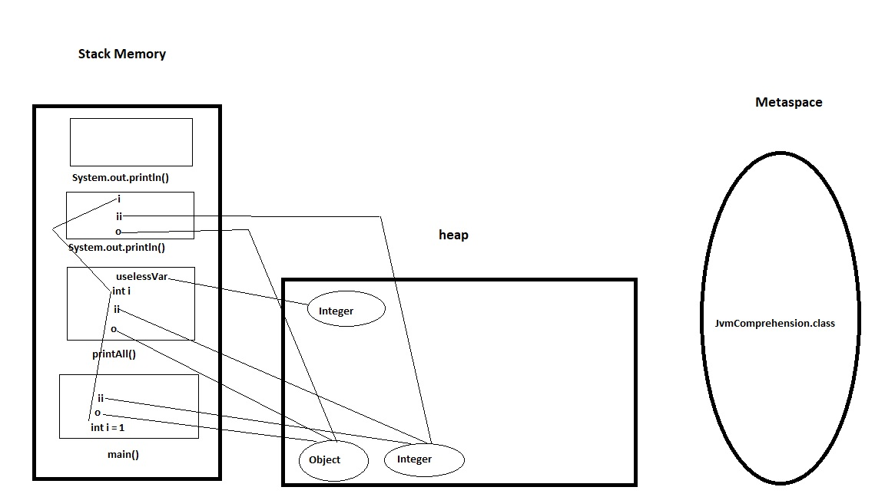

```java
public class JvmComprehension {

    public static void main(String[] args) {
        int i = 1;                      // 1
        Object o = new Object();        // 2
        Integer ii = 2;                 // 3
        printAll(o, i, ii);             // 4
        System.out.println("finished"); // 7
    }

    private static void printAll(Object o, int i, Integer ii) {
        Integer uselessVar = 700;                   // 5
        System.out.println(o.toString() + i + ii);  // 6
    }
}
```

### Корявый рисунок :-)



### Обьяснение рисунка:

В Metaspace сохраняется информация о классе JvmComprehension  
В стеке создается фрейм main  
1 пункт: в фрейме main создается int i  
2 пункт: создается в куче Object, в фрейме main создается ссылка о на этот обьект  
3 пункт: создается в куче Integer с значением 2, в фрейме main создается ссылка ii на него  
4 пункт: в момент вызова метода printAll создается новый фрейм в стеке с набором ссылок на переданные обьекты  
5 пункт: в куче создается Integer с значением 700, фрейме printAll создается ссылка uselessVar на него  
6 пункт: создается в стеке новый фрейм System.out.println с набором ссылок на переданные обьекты  
Фрейм System.out.println завершил свою работу и вынимается из стека  
Фрейм printAll завершил свою работу и вынимается из стека   
Из кучи сборщиком мусора удаляется Integer с значением 700, так как на него нет действующих ссылк  
7 пункт: в стеке создается фрейм System.out.println  
Фрейм System.out.println завершил свою работы и вынимается из стека  
Фрейм main завершил сою работу и вынимается из стека

Далее наверно сборщик мусора удаляет все оставшиеся обьекты из кучи так как на них нет активных ссылок...но это не точно :-)


